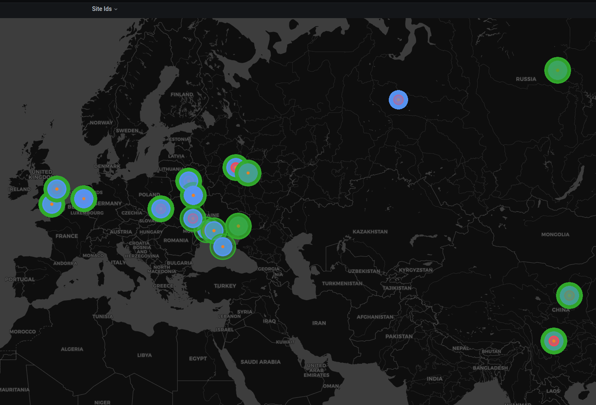

### Cybera Cloud site exporter for VictoriaMetrics


#### QuickStart

 Start `VictoriaMetrics` database:

```bash
./bin/victoria-metrics-prod
```


 Start mock-server - download it from releases page [link](https://github.com/f41gh7/cybera-exporter/releases/download/v0.0.1/mock-server):
```bash
./bin/mock-server --port=8013
```
 macOS [link](https://github.com/f41gh7/cybera-exporter/releases/download/v0.0.1/mock-server-darwin)
 
 Start exporter with given api url, username and password, pointing to your `VictoriaMetrics`
```bash
./bin/exporter -cybera.url=http://localhost:8013 -cybera.username "ff" -cybera.password="pass" --vm.url=http://localhost:8428
```


 Scrapped metrics should be available at `VictoriaMetrics` database with metric name `vm_cybera_site_info`

 And at local endpoint: 
```bash
curl http://localhost:8436/api/metrics
```


 For visualisation install grafana plugin:
```bash
grafana-cli plugins install grafana-worldmap-panel
```
https://grafana.com/grafana/plugins/grafana-worldmap-panel/?tab=installation

 add dashboard from `dashboards/site.json`

 


#### Configuration


  Important Configuration flags:
```bash
-cybera.scrapeConcurrency - how many requests execute concurently to cybera cloud api for retrieving information about site
-cybera.scrapeInterval - how often fetch information from cybera cloud api
-vm.pushInterval - how often push metrics to VictoriaMetricsDatabase
```

#### local build

```bash
make build
```